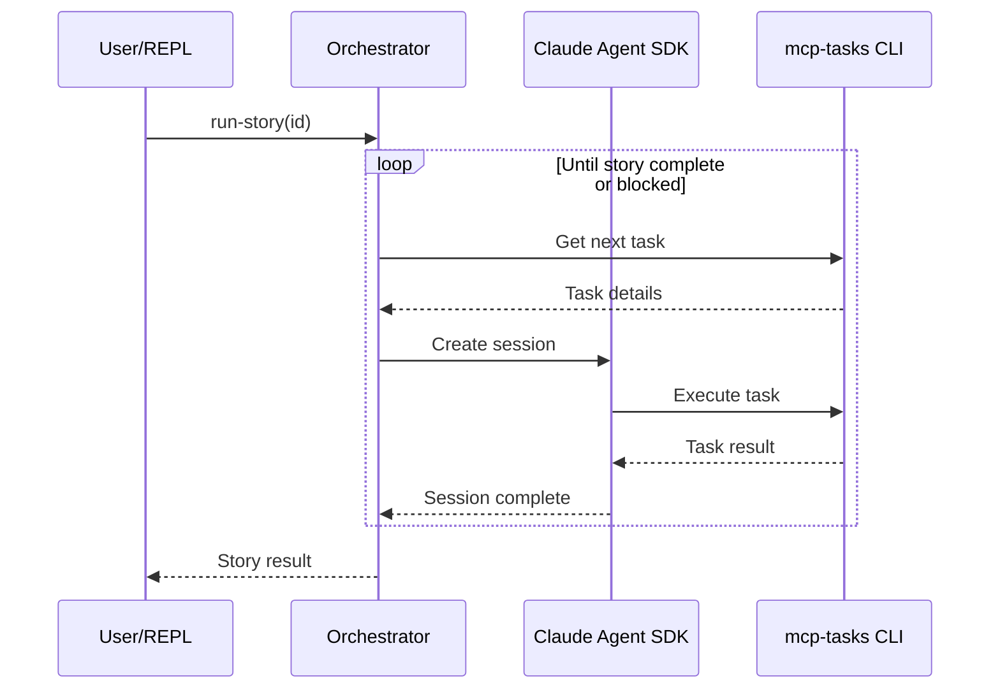

# task-conductor

Orchestrates multiple Claude agents for complex task execution.

## Setup

```bash
# Pull clj-kondo config from dependencies
bb kondo-config

# Start REPL with dev namespace
clj -M:dev:nrepl
```

## Running

### Python Environment

```bash
# Create virtual environment
python3 -m venv components/claude-agent-sdk/.venv

# Install Claude Agent SDK
components/claude-agent-sdk/.venv/bin/pip install -r components/claude-agent-sdk/requirements.txt
```

Alternatively, running tests will auto-create the venv via kaocha hooks.

### Workspace Setup

Workspaces allow managing multiple projects. Each project has independent
console state for concurrent story execution.

```clojure
(require '[task-conductor.workspace.interface :as workspace])

;; Add projects to the workspace
(workspace/add-project! "/path/to/project-a")
(workspace/add-project! "/path/to/project-b")

;; Set which project is focused (used when workspace arg is nil)
(workspace/set-focused-project! "/path/to/project-a")

;; Query workspace
(workspace/list-projects)      ;; List all registered projects
(workspace/focused-project)    ;; Get current focused project
```

### Story Execution

From the REPL:

```clojure
(require '[task-conductor.claude-agent-sdk.interface :as sdk])
(require '[task-conductor.agent-runner.repl :as repl])

;; Initialize the Python SDK (required once per JVM session)
(sdk/initialize! {:venv-path "components/claude-agent-sdk/.venv"})

;; Execute a story (uses focused workspace)
(repl/run-story 123)

;; Or specify workspace explicitly
(repl/run-story "/path/to/project" 123)
(repl/run-story :project-alias 123)  ;; keyword matching last path segment
```

For resetting console state:

```clojure
(require '[task-conductor.agent-runner.console :as console])
(console/reset-state!)           ;; Reset all workspaces
(console/reset-state! workspace) ;; Reset specific workspace
```

### Control Functions

All control functions accept an optional workspace argument (nil uses focused):

```clojure
(repl/status)      ;; Check current state
(repl/pause)       ;; Pause after current task completes
(repl/continue)    ;; Resume paused execution
(repl/abort)       ;; Cancel and return to idle

;; With explicit workspace
(repl/status "/path/to/project")
(repl/pause :project-alias)
```

### Error Recovery

```clojure
(repl/retry)       ;; Re-attempt failed task
(repl/skip)        ;; Skip failed task, continue to next
```

### Context Management

```clojure
(repl/add-context "Important note for agents")  ;; Add to story shared-context
(repl/view-context)                              ;; Display shared-context
(repl/list-sessions)                             ;; List sessions for current story
```

### Emacs Dev-Env Integration

When running with Emacs, CLI handoffs use the dev-env socket for async
interaction instead of blocking the REPL:

```clojure
;; Manual CLI session management
(repl/open-cli)                           ;; Open new CLI session in Emacs
(repl/open-cli {:session-id "abc-123"})   ;; Resume existing session
(repl/open-cli {:prompt "Hello"})         ;; With initial prompt
(repl/close-cli tracking-id)              ;; Close a session
(repl/disconnect-dev-env)                 ;; Disconnect from Emacs
```

Requires `task-conductor-dev-env-start` to be called in Emacs first.

## Architecture



## Development

```bash
# Run tests
clj -M:test

# Format code
clj -M:dev -m cljfmt.main fix
```
