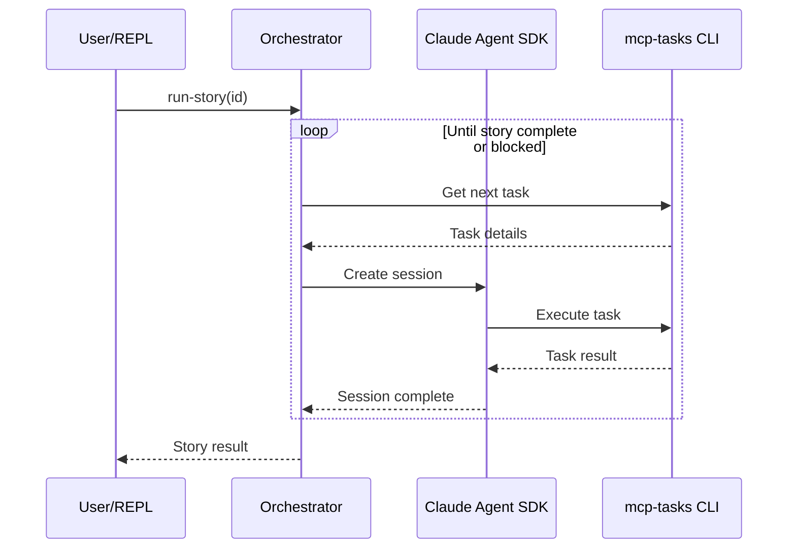

# task-conductor

Orchestrates multiple Claude agents for complex task execution.

## Setup

```bash
# Pull clj-kondo config from dependencies
bb kondo-config

# Start REPL with dev namespace
clj -M:dev:nrepl
```

## Running

### Python Environment

```bash
# Create virtual environment
python3 -m venv components/claude-agent-sdk/.venv

# Install Claude Agent SDK
components/claude-agent-sdk/.venv/bin/pip install -r components/claude-agent-sdk/requirements.txt
```

Alternatively, running tests will auto-create the venv via kaocha hooks.

### Story Execution

From the REPL:

```clojure
;; Require the SDK and REPL namespaces
(require '[task-conductor.claude-agent-sdk.interface :as sdk])
(require '[task-conductor.agent-runner.repl :as repl])

;; Initialize the Python SDK (required once per JVM session)
(sdk/initialize! {:venv-path "components/claude-agent-sdk/.venv"})

;; Execute a story
(repl/run-story 123)
```
For resetting the console state, use:

``` clojure
(require '[task-conductor.agent-runner.console :as console])
(console/reset-state!)
```

### Control Functions

```clojure
(repl/status)    ;; Check current state
(repl/pause)     ;; Pause after current task completes
(repl/continue)  ;; Resume paused execution
(repl/abort)     ;; Cancel and return to idle
```

## Architecture



## Development

```bash
# Run tests
clj -M:test

# Format code
clj -M:dev -m cljfmt.main fix
```
